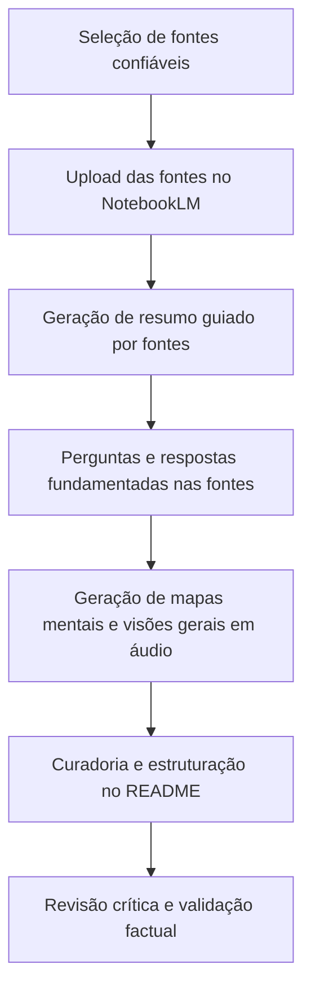

## Tim Berners-Lee e a Evolução da World Wide Web
> Um estudo completo sobre a origem, evolução, arquitetura e futuro da Web, baseado na trajetória de Sir Tim Berners-Lee.

<table>

## Sumário

- [Assunto de Interesse](#-assunto-de-interesse)
- [Objetivos de Estudo](#-objetivos-de-estudo)
- [Estrutura do Repositório](#-estrutura-do-repositório)
- [Metodologia NotebookLM](#-metodologia-notebooklm)
- [Trilha de Estudos](#-trilha-de-estudos)
- [Organização do Projeto](#-organização-do-projeto)
- [Referências](#-referências)
- [Como Contribuir](#-como-contribuir)
- [Licença](#-licença)
- [Autor](#-autor)

</table>

<table>
  
## 📖 Assunto de Interesse

O tema escolhido para este caderno temático é a **trajetória de Sir Tim Berners-Lee e a evolução da World Wide Web**.

A Internet transformou profundamente a sociedade moderna, mas sua evolução não ocorreu de forma instantânea. Antes da criação da Web, já existiam redes de computadores, protocolos de comunicação e iniciativas voltadas ao compartilhamento de informações.

Este repositório documenta, de maneira cronológica e técnica, como essas tecnologias evoluíram até culminarem na criação da **World Wide Web** por Tim Berners-Lee, pesquisador do CERN e fundador do **World Wide Web Consortium (W3C)**. Além do aspecto histórico, o estudo investiga os princípios arquiteturais que tornaram a Web aberta, interoperável e escalável, bem como os desafios atuais relacionados à centralização de dados, privacidade e soberania digital — incluindo iniciativas como o **projeto Solid**.

Este tema foi escolhido por conectar dois eixos de interesse: a **história da Ciência da Computação** e a **engenharia de sistemas distribuídos abertos**, ambos fundamentais para compreender a internet como ela é usada hoje.

**Público-alvo:**
- Estudantes de Ciência da Computação e áreas correlatas
- Profissionais de tecnologia interessados na história da Web
- Pesquisadores de arquitetura de sistemas distribuídos
- Praticantes de Engenharia de IA interessados em fluxos de estudo assistidos por IA

</table>

<table>
  
## 🎯 Objetivos de Estudo

Este caderno temático possui cinco objetivos principais:

- [ ] Compreender o contexto histórico anterior à criação da Web
- [ ] Estudar a contribuição de Tim Berners-Lee para a Ciência da Computação
- [ ] Analisar a arquitetura técnica da World Wide Web
- [ ] Compreender a padronização promovida pelo W3C
- [ ] Investigar a evolução da Web até iniciativas modernas, como Web Semântica, Net Neutrality e Solid

Paralelamente ao conteúdo histórico, o projeto também tem como objetivo **explorar o poder do NotebookLM** como ferramenta de Engenharia de IA para pesquisa, síntese e organização de conhecimento a partir de fontes confiáveis.

</table> 
  
<table>

  ## 🗂 Estrutura do Repositório

> **Nota:** o repositório encontra-se em estágio inicial. Novos materiais (notas, resumos, mapas mentais e referências complementares gerados a partir da metodologia NotebookLM) serão adicionados conforme o estudo avança.
  
</table>

<table>
 
## 🧠 Metodologia NotebookLM

Este projeto adota o **NotebookLM** (Google) não apenas como ferramenta de apoio, mas como o núcleo metodológico do processo de estudo — funcionando como um exercício prático de **Engenharia de IA** aplicada à pesquisa.

### Como o NotebookLM é utilizado

| Etapa                          | Descrição                                                                                     |
|---------------------------------|-------------------------------------------------------------------------------------------------|
| Seleção de fontes                | Escolha de materiais confiáveis (artigos, documentação do W3C, biografias, publicações técnicas) |
| Ingestão no NotebookLM           | As fontes são carregadas para formar uma base de conhecimento fechada e rastreável              |
| Síntese guiada por fontes         | O NotebookLM gera resumos e explicações **ancorados exclusivamente** no material fornecido       |
| Perguntas e respostas (Q&A)      | Uso de prompts estruturados para extrair conceitos-chave, cronologias e relações causais         |
| Recursos multimídia              | Geração de mapas mentais e *Audio Overviews* para reforçar a compreensão do conteúdo             |
| Curadoria humana                 | Todo o conteúdo gerado é revisado, validado e reorganizado manualmente antes de compor o README  |

### Por que essa abordagem é relevante para Engenharia de IA

- Demonstra o uso de **RAG (Retrieval-Augmented Generation)** aplicado a um caso real de estudo, reduzindo alucinações ao restringir as respostas às fontes carregadas.
- Exercita **engenharia de prompt** para obter sínteses, comparações e cronologias precisas.
- Evidencia um fluxo de trabalho reprodutível de **curadoria de conhecimento assistida por IA**, da fonte bruta à documentação final.

</table>

